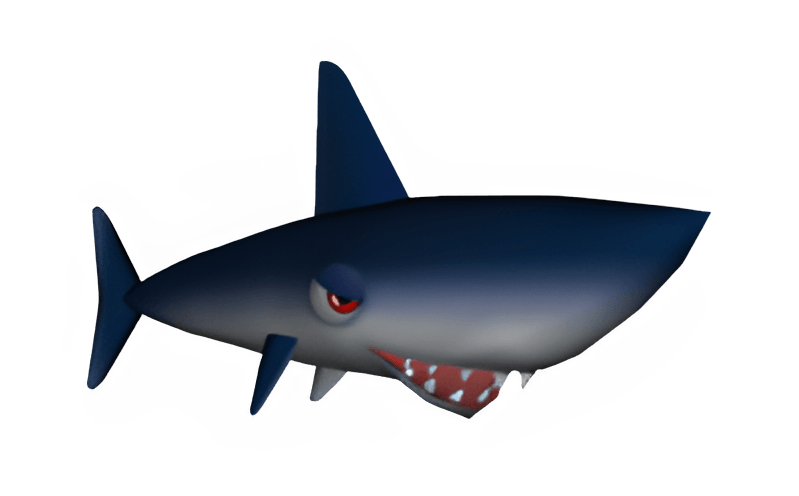

    

<h3 align="center">Hainz</h3>
 

    
    
    
     
    
    
    
    

**Hainz** is a [Discord](https://discord.com/) bot for server administration, music, entertainment and more. It's built on top the [Discord.NET]() framework.

*This project is still in develpment*